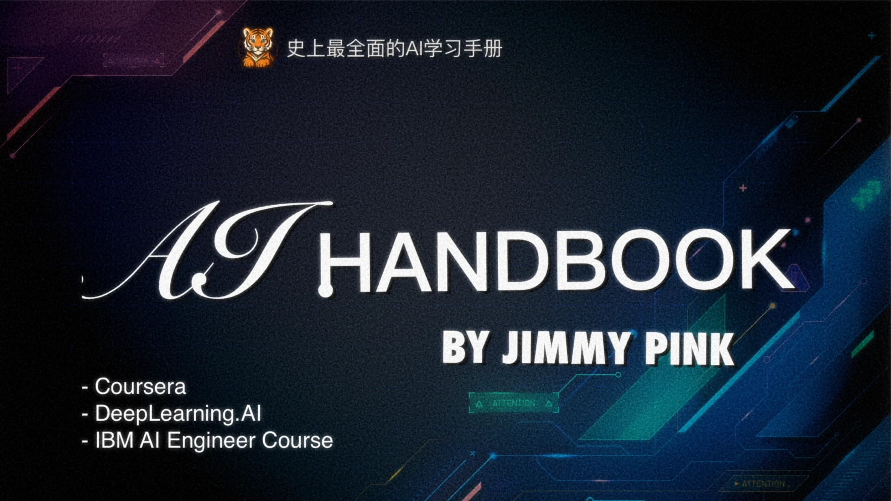

# AI学习手册

史上最全面的AI学习手册，面向**普通白领、程序员、创业者**及**业余AI学习爱好者**。

[🔗 访问 GitHub Pages](https://jimmy-zhz.github.io)  
[🔗 访问 GitHub Repo](https://github.com/jimmy-zhz/jimmy-zhz.github.io)

<h1 style="
  text-align: center;
  font-size: 3em;
  font-weight: 800;
  font-family: 'Arial Black', sans-serif;
  margin: 0.5em 0;
  background: linear-gradient(45deg, #0061ff, #60efff);
  -webkit-background-clip: text;
  background-clip: text;
  color: transparent;
  text-shadow: 0 2px 4px rgba(0,0,0,0.1);
  letter-spacing: 1px;
  position: relative;
  display: inline-block;
  padding: 0 20px;
">
  
  Jimmy's AI 学习手册
</h1>

欢迎来到 **Jimmy‘s AI学习手册**！  
这是一本精心整理的学习笔记、教程与资源融合。
- 记录了系统学习人工智能的完整路径
- 整理了坊间流传的知名AI学习手册
- 数万次AI知识交流，对关键知识点做详细补充和绘图解释

无论你是刚入门的新手，还是正在进阶的学习者，这份手册都能为你提供**结构化、系统化的学习资料**，涵盖从基础概念到前沿应用的广阔领域。

### ✨  特点

- 面向初学者到中高级AI学习者，注重循序渐进。
- **内容严谨**：
	- 参考了Coursera、MIT、斯坦福等优质公开课程
	- 多平台生成式AI知识构建和复核。
- 多渠道知识搬运
- **自用+共享**：原本为个人学习整理，现开放共享，希望帮助更多人高效掌握AI技术。

---

## 📚 知识大纲

> 📂 完整目录见左侧导航栏（Explorer）

本手册结构化地划分为以下核心章节：

1. **学习序言** —— 为什么要学习AI？
2. **基础必备** —— 数学、Python编程、常用工具。
3. **机器学习** —— 监督学习、无监督学习、常见算法。
4. **深度学习** —— 卷积神经网络（CNN）、循环神经网络（RNN）、Transformer。
5. **计算机视觉** —— 图像分类、目标检测、图像分割。
6. **自然语言处理（NLP）** —— 文本处理、语言模型、LLM。
7. **RAG 技术** —— 基于检索增强生成的应用。
8. **AI智能体（Agent）** —— MCP，A2A，Prompt，Agent
9. **推荐系统** —— 从基础推荐到智能推荐系统构建。
10. **AI全栈开发** —— 后端、前端与模型部署实践。

---

## 📖 知识库说明

### 重要引用参考资料列表

+ 《The Document is All You Need！一站式LLM底层技术原理入门指南》by 陈敏凯 
	+ 特点：非常适合小白快速入门，搞懂基本原理
+ ==Coursera AI 相关课程==
	+ [劳伦斯的AI课程](https://www.coursera.org/instructor/lmoroney)
		+ 特点：课程互动性强、实践性高，Laurence讲师带做经典入门DNN案例
	+ [吴恩达的AI课程](https://www.coursera.org/instructor/andrewng)
		+ 特点：理论与实践结合；强调算法、数学原理，并通过编程实现。
+ [《动手学深度学习》by b站李沐](https://zh-v2.d2l.ai/) 
+  [跟着迪哥学Python数据分析与机器学习实战](https://github.com/tangyudi/Ai-Learn)
+ https://roadmap.sh/ai-engineer

### 基于 Obsidian 构建

本知识库基于 [Obsidian](https://obsidian.md) 编辑与管理，  
推荐使用 Obsidian 阅读，特别是在手机端，可获得更加顺畅、沉浸式的学习体验。

### 承诺长期维护

本手册承诺持续更新与维护，  
不仅对已有内容不断打磨完善，也会同步总结AI领域的新兴技术与趋势，致力于打造最实用、最全面的AI学习参考书。

---

如果你喜欢这份知识库，欢迎 [⭐Star支持](https://github.com/jimmy-zhz/jimmy-zhz.github.io)！  
你的支持，是我持续更新的最大动力！🚀